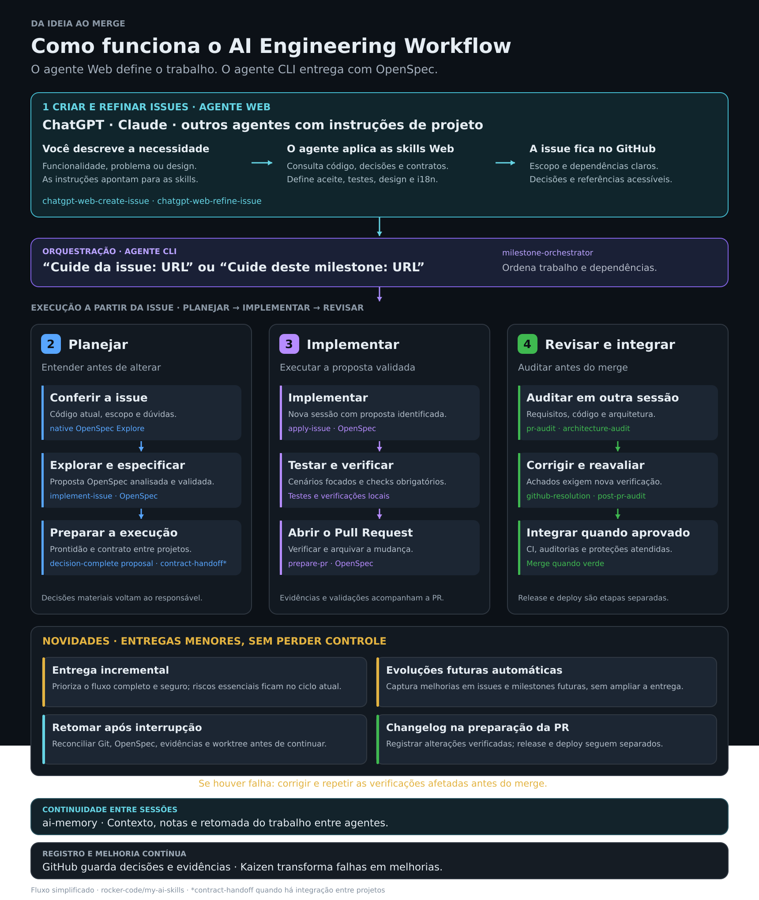

# AI Engineering Workflow

Português (Brasil) · [English](README.en.md)

Skills e ferramentas para desenvolvimento com IA orientado por issues. O GitHub registra decisões e entregas; o OpenSpec estrutura o planejamento e a implementação.

## Fluxo de trabalho

O fluxo começa no agente Web: você descreve a necessidade, as skills consultam o contexto e criam/refinam a issue no GitHub. Depois, o agente CLI recebe a issue ou milestone e conduz o planejamento, a implementação e a revisão.

O ciclo passa por descoberta, prontidão, implementação, revisão e conclusão. OpenSpec é obrigatório; `openspec-workflow` rege exploração, propostas, validação da revisão exata, verificação da implementação e arquivamento.

### Retomar após interrupção

Em uma **nova sessão nativa do OpenCode ou Codex**, no checkout correspondente, peça **“continue de onde parou”** ou informe a URL da issue/milestone a retomar. A skill global `resume-workflow` reconcilia Git/GitHub, OpenSpec, evidências e a posse da worktree antes de delegar ao `milestone-orchestrator`. Quando o escopo ou a posse não forem verificáveis, preserva o trabalho e solicita somente a informação necessária, sem sobrescrever arquivos. Trocar de agente reaproveita artefatos duráveis, não histórico de chat; é preciso comprovar parada do writer anterior e transferir a reserva. Um teste/comando interrompido não é considerado aprovado sem evidência final. Alterações que nunca saíram de um disco perdido não podem ser restauradas automaticamente.

Após uma instalação global atualizada, `worktree-reservation verify --session <id>` verifica a posse a partir de qualquer subdiretório do checkout; informe `--path <checkout>` ao selecionar outra worktree e `--json` para automação. A sessão sempre vem do chamador. Antes da atualização, use o helper em `~/.local/share/my-ai-skills/active/scripts/worktree-reservation` com `--path` explícito.



[Veja o fluxo completo na wiki](https://github.com/rocker-code/my-ai-skills/wiki/Guia-do-fluxo).

## Instalar ou atualizar

Linux/macOS: requer Git, Python 3.10+, `curl`, `gh`, `jq` e somente o agente selecionado no `PATH`: OpenCode V2 ou Codex CLI com `exec --json/--cd/--ephemeral/--sandbox`. Para usar o workflow, OpenSpec **2.x** é necessário, mas **não precisa estar instalado antes**: o instalador verifica o CLI existente sem substituí-lo, recusa 1.x com instrução para atualizá-lo pela origem, ou instala a distribuição standalone oficial para seu usuário se estiver ausente. Autentique GitHub e o agente separadamente. Preflight/version/help não comprovam autenticação, execução de modelo, subagentes ou revisão independente.

Execute o instalador diretamente do GitHub:

```bash
curl -fsSL https://raw.githubusercontent.com/rocker-code/my-ai-skills/main/scripts/install.sh | sh -s -- --agent opencode
```

O script instala a versão mais recente da `main`. Ele baixa o **instalador** do commit imutável `06139455da07e336d6969b66f90194afeb9302b8`, confere seu SHA-256 `c8d4a9cc367fc40b754374c2fa7e774bd288db1a3806d645835eb65922d195f7` e só então o usa para instalar a revisão atual, incluindo o comando global `worktree-reservation`.
Esse commit precisa permanecer ancestral da `main`: integre esta PR por **merge commit**, nunca squash/rebase, para publicar o launcher e seu objeto pinado juntos. Se o `curl` falhar, ele avisa, mas o pipeline pode retornar sucesso sem instalar nada. **A verificação não cobre o próprio script obtido de `main`**: revise [seu código](scripts/install.sh) antes de executá-lo ou use o [comando com entrada verificada](https://github.com/rocker-code/my-ai-skills/wiki/Instalacao-global) para maior garantia.

Para **atualizar para a versão mais recente da `main`**, execute (somente quando quiser atualizar):

```bash
curl -fsSL https://raw.githubusercontent.com/rocker-code/my-ai-skills/main/scripts/update.sh | sh
```

**Os dois comandos instalam a revisão mais recente ao serem executados.** `update.sh` apenas deixa explícita a intenção de atualizar; ele confia na `main` atual e chama o mesmo instalador verificado. Nenhuma atualização roda em segundo plano. Não use `npx skills update` nem execute o instalador da instalação ativa para atualizar o pacote. [Detalhes, conflitos e migração](https://github.com/rocker-code/my-ai-skills/wiki/Instalacao-global).

Na primeira instalação, escolha `--agent codex` em vez de `--agent opencode` para usar somente Codex; repita `--agent opencode --agent codex` para ambos. Não há autodetecção nem default implícito. Update sem flags preserva a seleção comprovada; seleção explícita posterior é **aditiva**, inclusive na mesma revisão. Não remove agentes por omissão; runtime mantido ausente bloqueia com diagnóstico.

Um snapshot canônico fica em `${XDG_DATA_HOME:-$HOME/.local/share}/my-ai-skills/versions/<SHA>`, com `active` compartilhado. Manifesto schema 2 registra integrações **disponíveis**, arquivos/modos/origem; `guidance.json` schema 2 registra agentes **instalados**, caminhos e hashes dos blocos gerenciados. Instalações OpenCode schema 1 são verificadas contra Git confiável antes da migração, sem regravar versões antigas. Links OpenCode ficam em `${XDG_CONFIG_HOME:-$HOME/.config}/opencode/skills`; links Codex em `$HOME/.agents/skills` (não relocados por CODEX_HOME), com orientação em `${CODEX_HOME:-$HOME/.codex}/AGENTS.md`. Ambos apontam para o mesmo `active/skills`.

Config/auth/hooks permanecem intocados. CODEX_HOME/XDG alterados, symlinks ancestrais, origem incerta, skills homônimas/desabilitadas ou `AGENTS.override.md` sombreando orientação exigem reconciliação explícita. Colisão em um agente impede publicação nos dois; falha reverte somente efeitos comprovadamente próprios. Diagnóstico local com `--project` não autoriza edição; `--baseline-revision` e `--reconcile-path` autorizam somente paths idênticos ao baseline, com backup. Consulte a skill `update-ai-workflow` para os limites.

Provas reais isoladas: `PYTHONDONTWRITEBYTECODE=1 python3 tests/smoke_global_opencode.py` e `PYTHONDONTWRITEBYTECODE=1 python3 tests/smoke_global_codex.py --controller-session <ID-nativo-do-chamador> --auth-cache <auth.json-explícito>`. Codex também aceita token suportado via ambiente/stdin. Para o cenário adicional de retomada entre agentes, acrescente `--cross-agent-opencode` (exige OpenCode explicitamente; o cenário Codex-only não o exige). Esse cenário usa sessões/skills/shell nativos OpenCode, não execução de modelo OpenCode. O cache é copiado com permissão restrita e removido ao finalizar; nenhuma configuração real é copiada. Sem credencial/capacidade/término, o smoke **bloqueia**, não passa por skip. Os relatórios privados distinguem descoberta/invocação, contextos novos, lifecycle/testes reais e backend GitHub fixture; não comprovam checks/review/merge hospedados.

Caches Python (`__pycache__`, `.pyc`, `.pyo`) não bloqueiam a atualização. Arquivos e diretórios extras comuns são preservados na versão anterior, com aviso, ao trocar de revisão; não são migrados. Arquivos oficiais alterados ou ausentes e links simbólicos inesperados continuam bloqueando. A versão de destino mantém a validação estrita de entradas extras desconhecidas.

## Configurar o projeto no agente Web

Para usar as duas skills nas conversas do projeto, mantenha o conector GitHub disponível com acesso ao `rocker-code/my-ai-skills` e aos repositórios de destino. Copie o bloco abaixo para as **instruções do projeto no agente Web** (ChatGPT, Claude ou equivalente). Ele orienta a consulta das instruções atuais no GitHub; não instala skills automaticamente nem altera as configurações da conta por si só.

Não é necessário anexar os arquivos das skills a cada conversa quando o conector consegue lê-los. As regras detalhadas ficam nos protocolos versionados: alterações passam a ser consultadas após o merge em `main`. Atualize este bloco nas configurações se o próprio texto de encaminhamento mudar. Se a leitura pelo conector falhar, o agente deve informar quais fontes não conseguiu consultar, sem afirmar que aplicou a versão atual.

O mesmo texto pode ser usado nas instruções de projeto do ChatGPT, Claude ou de outro agente que aceite descrições persistentes do projeto. A capacidade depende do ambiente: ler instruções não concede acesso ao GitHub nem permissão para criar issues. Se não houver integração de escrita, o agente pode preparar um rascunho, informando que a publicação não foi realizada.

### Instruções para copiar

```text
# Rocker Code — Project Instructions

This project uses AI Engineering Workflow, available at
https://github.com/rocker-code/my-ai-skills, as its reference
for software engineering and GitHub issue management.

## Web agent skills (ChatGPT, Claude or equivalent)

Use these instructions in ChatGPT, Claude or another agent with project instructions.
The chatgpt-web-* names are retained for compatibility. Source read access is required;
issue mutations require an authorized GitHub integration.

At the start of each issue creation or review task, use the available GitHub
integration to read the current main version of the relevant skill and shared protocol:

- Creation: skills/chatgpt-web-create-issue/SKILL.md
- Review/refinement: skills/chatgpt-web-refine-issue/SKILL.md
- Protocol: protocol/CHATGPT_WEB_ISSUES.md
- Visual design, when applicable: protocol/VISUAL_ARTIFACTS.md

For quick roadmap queries (“me situa”, “where are we”, “how is the MVP”,
“what should I do next”), read skills/roadmap-status/SKILL.md on main through
GitHub integration and follow it. Show up to 5 table rows, one next step and
pending decisions; disclose access limitations and do not execute changes.

When I ask “update my-ai-skills” or “update this project’s AI workflow”, read
skills/update-ai-workflow/SKILL.md on main and follow it. Run only on explicit
request, preserving agents, scope and local changes. If local execution is
unavailable, report the limitation and give the next required CLI command;
do not claim my local installation was updated.

Also read the necessary references linked by these files. Reuse the reads within
the same task; refresh them after relevant changes. If a source is inaccessible,
report the limitation and do not invent its contents.

## Rules

- Apply the appropriate skill without requiring special commands.
- Inspect issues, comments, decisions, PRs and relevant code; identify the inspected
  revision and existing implementation to avoid duplicate work.
- Preserve Magento, Mobile and Operational App conventions. Distinguish verified
  facts, approved decisions, proposals and open questions.
- Start each issue with a plain summary: what changes, where and what it depends on.
  Define expected behavior, scope, non-goals and observable acceptance criteria.
- Include test scenarios in a table with setup/action, expected result and suggested
  proving layer. Focus on real risks, reuse tests and fixtures and avoid exhaustive
  matrices or duplicate coverage.
- For integrations, document current and expected signatures, examples, states,
  errors, authorization and producer/consumer dependencies. Mark proposed contracts
  as unimplemented/unfrozen; record the effective signature after the handoff
  before final integration.
- For backend, integration or architecture changes, include a simple Mermaid system
  design with verifiable responsibilities and data flow.
- For interfaces, include a character wireframe in a text block, key states/actions
  and accessible, versioned, approved visual references when a design exists.
  Illustrative values are not real data. Follow VISUAL_ARTIFACTS.md; a private
  Claude Artifacts link alone does not prove design access.
- For user-facing content, include i18n and translation using the project's existing
  mechanism and locale: copy, states, errors, accessibility, dates, numbers, currency
  and plurals. Define who localizes API text; do not expose raw enums or keys.
  Preserve domain names/data and provide safe translated fallbacks for unknown
  codes, with representative acceptance criteria and tests.
- Keep behavior, design, wireframes, contract, criteria and tests consistent.
  Narrow changes must preserve unrelated content and decisions.
- Explain technical questions and alternatives simply when a material user decision
  is pending. Resolve routine details through evidence and do not request extra
  confirmation for actions already requested or authorized.
- Record approved decisions in issues when requested. Verify GitHub mutations before
  claiming success and provide links and remaining blockers.
- Do not implement code while authoring/refining issues; execution follows the CLI
  workflow with OpenSpec. Do not invent inspected code, contracts, attachments
  or executed tests.

## Forma de trabalho

Aceite pedidos naturais como:
- "Crie uma issue para..."
- "Analise a issue #123."
- "Responda à dúvida desta issue."
- "Revise as issues do milestone."
- "Atualize a especificação considerando o design anexado."

Não exija que o usuário repita estas instruções.
```

## Ciclo simplificado

OpenSpec é o único ciclo: Explore → Propose → Apply → Verify → Archive. O pacote integra GitHub, testes/M2T e entrega, sem audit/ready separados. Uma issue é executada por vez, inclusive planejamento; subagentes atuam apenas na issue ativa. Revisão independente válida do HEAD final é reutilizada. Kaizen fica sob demanda e não bloqueia a próxima issue. Não há comentários operacionais automáticos. `simplify` é opcional para problema concreto de manutenção, preservando comportamento.

Prioridades: código claro com arquitetura existente, verificação efetiva e melhorias relevantes ainda não rastreadas. Verify oficial é padrão quando suportado e não substitui testes/CI/reviews. Skill ausente não comprova incompatibilidade: inspecione `openspec config list`, preserve a união dos workflows atuais com `verify` no perfil `custom` (`openspec config set workflows '[...]'` e `openspec config set profile custom`) e confira efeitos globais e `openspec update --dry-run --json` antes do update autorizado. Preserve personalizações e reporte limitações reais sem verificador customizado. Este repositório inclui Verify gerado oficialmente.

## Métricas legadas

Os comandos `workflow-event` e `workflow-report` foram removidos. Não há coleta de tempos, analytics nem comentários operacionais automáticos. Comentários e arquivos arquivados antigos permanecem como histórico, sem servir de fonte ativa. Progresso e retomada usam Git/GitHub/OpenSpec, runtime suportado, posse do checkout e provas de testes existentes.

## Usar

O instalador e o atualizador conferem ao final o pacote, cada integração selecionada e o OpenSpec. Abra uma nova sessão do agente escolhido. No primeiro uso em um projeto, o agente confere a integração OpenSpec 2.x e pede autorização específica antes de inicializar ou atualizar; a instalação global não modifica projetos. Confira descoberta e invocação das skills oficiais `openspec-explore`, `openspec-propose`, `openspec-apply-change`, `openspec-verify-change` e `openspec-archive-change`; comandos `/opsx-*` legados não são exigidos. Habilite Verify pelo perfil oficial preservando workflows existentes; use `--scope project` nas fixtures quando suportado. Preserve ferramentas já configuradas, arquivos personalizados e config/specs/changes; bloqueie conflitos sem forçar. Codex usa skills nativas (`$nome-da-skill`) e execuções novas verificadas; não exige OpenCode nem simula sua API.

Peça **“Cuide da issue: URL”**, **“Cuide da fila deste projeto”** ou **“Cuide deste milestone: URL”**; acrescente **“sem merge”** se quiser integrar manualmente. O fluxo planeja com OpenSpec, implementa, testa, prepara a PR e revisa; o merge padrão só ocorre após as verificações exigidas. O agente precisa de acesso ao GitHub e de sessões/worktrees isoladas para executar o fluxo completo.

A preparação de PR chama `update-changelog` para registrar mudanças relevantes em **Não lançado**, atualizando o arquivo existente ou criando `CHANGELOG.md`. A skill `release` consolida as entradas da versão antes da validação final. Também é possível pedir “gere o changelog” diretamente.

[Guia do fluxo e demais recursos](https://github.com/rocker-code/my-ai-skills/wiki/Guia-do-fluxo) · [Instalação legada por projeto](https://github.com/rocker-code/my-ai-skills/wiki/Instalacao-legada) (não necessária para a instalação global) · [Wiki](https://github.com/rocker-code/my-ai-skills/wiki)
